```{r setup, include=FALSE}
knitr::opts_chunk$set(echo = FALSE)
```

## ABSTRACT  
The VAST 2014 Mini-challenge 2 provided a set of GPS vehicle tracking and credit card transaction data with the aim of inferring behavior of those using the vehicles and credit cards. In particular it required us to design interactive visual analytics system to Identify suspicious activities and suspicious relationships. In this paper we would introduce the approach we use to design interactive graph and our insight.  

## 1. INTRODUCTION AND MOTIVATION  
When GAStech’s IPO was celebrated in 2014, several employees of the company were strangely missing. Fortunately, Many of the Abila, Kronos-based employees of GAStech have company cars which are approved for both personal and business use. These cars are equipped with GPS tracking devices, which can provide tracking data for two weeks before the disappearance (no data on the day of disappearance). Credit card and loyalty card transactions data are also provided for case investigation. Taking the GPS monitoring results of the company’s employees as a whole can help us understand whether the company has organized group activities at a specific time, such as company team building or overtime, which leads to unexpected group behavior. This helps the police find out the suspect’s unusual travel time and destination. As for the credit card and loyalty card consumption records can help us find out whether the suspect has suspiciously large expenditures, and investigate whether it is possible to purchase suspicious items as criminal tools of crime through the location and name of business of the purchased items.  

## 2. OBJECTIVES  
In this research, we will build an R Shiny application to illustrate the results of current data visualization. The goal is to analyze the trajectory of the company's employees in the two weeks before the case, to find suspicious activities and suspicious locations, and to analyze the relationship between personnel in depth. Analysis and visualization are mainly divided into five parts. Based on the processed database and request in mini-challenge 2, we will conduct progressive analysis and visual display.

1.	According to the shop consumption situation, including the consumption amount and the exact time, explore the general consumption status of the shop, so as to find abnormal consumption situation in the follow-up.
2.	Visualize the trajectory of each vehicle and explore its periodic habits in order to find suspicious locations and relationships with characters.
3.	Combine GPS data and credit card and loyalty card consumption data to visualize the card that each employee is most likely to correspond to. Determine the corresponding relationship between the employee and the card based on the visualization results.
4.	Based on the previous results, explore the relationship between employees.
5.	Comprehensive analysis and detailed description of suspicious actions and character relationships.  

## 3.	REVIEW OF PAST WORKS  
Most of the insights on Mini-challenge 2 use methods such as geographic analysis, path analysis, character path analysis, consumption analysis, and association analysis. The main goal of our research is to analyze suspicious actions and suspicious person relationships, so in addition to the necessary basic analysis, we also need GPS tracking maps and person relationship maps. So that our research are mainly based on the Interactive exploratory data analysis, GeoVisual Analytics and Association Analysis. 

### 3.1	Interactive Exploratory Data Analysis  

Exploratory Data Analysis is the initial analysis that we perform on the data to understand the data. We are going to use statistical graphics to visualize the results of IEDA. Past work sometimes skipped this part of the analysis and mainly showed the trajectory or the relationship between the characters. However, considering the need to obtain the basic information of people's card consumption, the visualization of this part is still very necessary. We would use ggplot package to explore the data.

### 3.2	GeoVisual Analytics  

There is an increasing trend of usage of line plots, geographic maps, heat maps, histograms, and graphs for time series data. Below is the lecture review of several examples of interactive visual analysis available.

1. Regional map  
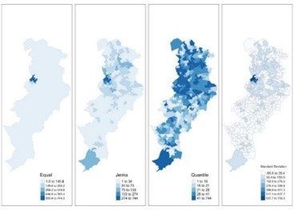{width=30%}  
It can be used to analyze data by region, reflecting the basic natural and economic conditions and regional characteristics of a certain region.  

2. Heatmap  
{width=30%}  
The heatmap is used to convert data into color tones within the geographic coordinate system, and intuitively reflect the distribution, frequency or density of the data in the geographic space through the degree of color change.  

3. Bubble Map  
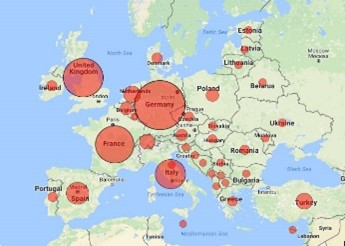{width=30%}  
Bubble map is a very common visualization map related to geographic location information. It can transmit multidimensional information at the same time. The location of the bubble is used to transmit physical location information.  

4. Trajectory graph  
{width=30%}  
Different lines can be identified by different colors, and the size of the line thickness is used to indicate the size of the passenger flow or the times the person pass this area.  

### 3.3	Association Analysis   
Since we would like to know the relationship between the employees, we would like to use network diagram to show whether employees are intimate or not. Then we could collaborate with gps data and find out when they go out together. We would explore with visNetwork package.  

## 4.	DESIGNFRAMEWORK AND USE CASE DEMONSTRATION  
On the left of the interface, we provide a navigation header that enables users to select the part they would like to explore. The four areas are Location & Consumption, GPS Tracking, Credit&Loyalty Card Owner and Relationship.  

### 4.1 Location & Consumption 
In this section, three selection buttons are provided at the top left. The user can select a credit card or a membership card to get a frequency histogram and a scatter plot of consumption amount. Users can also select all of them and compare the differences between membership cards and credit cards. A drop-down menu is provided on the upper right, and the user can select one of the stores and will get a heat map about the time and the number of consumption.  
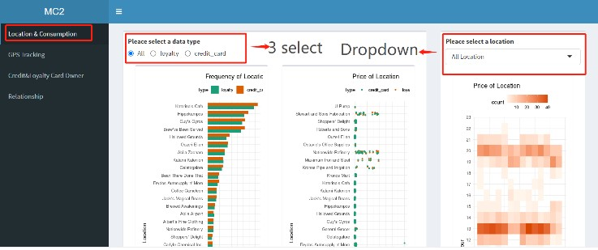{width=90%}  

### 4.2 GPS Tracking  
This part shows the daily trajectory of each employee. The drop-down menu on the left side of the interface can select the employee's name and date. After selection, a graph of the employee's action trajectory on the day will appear.  
{width=90%}   

### 4.3 Credit&Loyalty Card Owner  
4.3.1 Determine the GPS of the store  
After many discussions, we agreed that the most effective way is to confirm the GPS of the designated store by comparing the individual's driving trajectory on a designated number of days and the coordinates shown on the map. As shown in the figure below, the GPS data of the employee during this day showed that he stayed at about three locations outside the company. By comparing the staying location with the store location shown on the map, we can roughly get the estimated location of the store. After many comparisons, we found the home addresses of most shops and employees.  
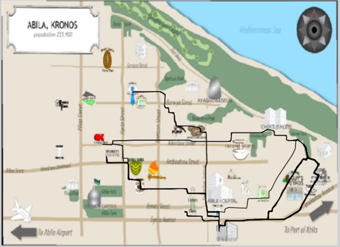{width=90%}   

4.3.2 Data Process  
Because we want to explore the card number corresponding to the vehicle id, we first process the data and then make the map. First, we associate the shop gps data and the consumption data of the two cards respectively. Secondly, these data are associated with the GPS data of the vehicle and the distance is calculated. Filter the data with a distance of no more than 10m to obtain a one-to-one correspondence with the card number and employee name. We can think that the card number with the most occurrence probability is the owner's card.  

4.3.3 Interface  
Two parts are displayed on this interface. On the left is the membership card and credit card number used by the employee after data processing. A drop-down menu is provided on the right, and the user can select the employee's name. After selection, a histogram of possible card numbers and corresponding times corresponding to the employee will appear.  
{width=90%}   

### 4.4 Relationship  
4.4.1 Data Process  
Because only credit card data is accurate to the minute, we only use credit card data for comparison. Correlate the consumption data of different people through locations to obtain non-personal pairs. If the difference in consumption time between two people is within ten minutes, we assume that they are related.  

4.4.2 Interface  
A drop-down menu is provided at the top left of the interface, where you can select a person's name. After selecting, you can see the character relationship network diagram on the right. In order to facilitate the observation of the relationship between employees, we set the nodes to different colors according to the type of employee employment. The left side contains the label of the type of color.  
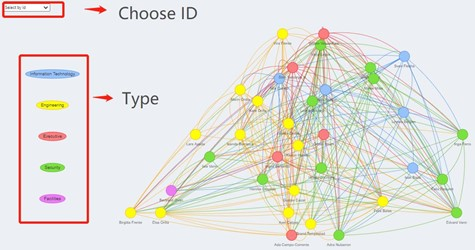{width=90%}   

## 5.	DISCUSSION  
### 5.1	The most popular shops and periods based on credit card and loyalty card data  
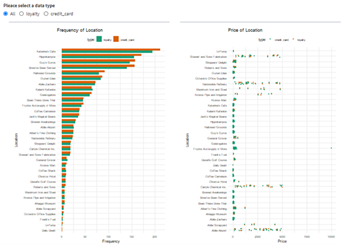{width=90%}   
As can be seen from the bar charts above, there are four shops that are obviously more popular compared with merchants: Katerina’s Cafe, Hippokampos, Guy’s Gyros and Brew’ve Been Served. Judging from the scatter plot of the transaction volume of each store, the overall consumption is relatively even. Among these stores, the transaction data of a few stores is more prominent, but none of them has a single transaction exceeding 5000 dollars. However, there is indeed an extreme outlier appeared in Frydos Autosupply n’ More, with a single transaction amount of 10,000, which is likely to be the behavior of the suspect.  
{width=40%}   
Also, Through the observation of the overall heatmap, it can be presumably inferred that the merchants’ business hours are 7-21 o’clock on weekdays and 12-20 o’clock on weekends, of which 7 o’clock, 12-13 o’clock and 20 o’clock are the morning, middle and evening peak hours of the day. Therefore, visits during non-business hours can be tentatively regarded as abnormal situations worthy of the police’s attention.  

### 5.2 Ownerships of credit cards and loyalty cards  
Because both the consumption data of the cards and the driving record data have timestamp variable, we can use the same time variables in these two tables to identify which vehicles stayed at a specific merchant at a specific time. And then find the corresponding consumers through the vehicle assignment data table, so that we can generate a list including all associations of card numbers and consumers. The combinations that appear frequently in multiple lists, that is, the association with the highest frequency, can be preliminarily determined as the ownership between the card and the consumer.  
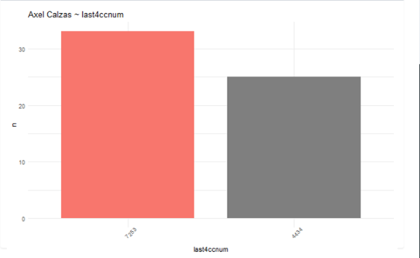{width=40%}   
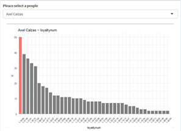{width=40%}   
However, this method will have some limitations, because we use the dispatching relationship of the car as a medium to determine the relationship between the cards and the consumers. In fact, unexpected situations are likely to occur, for example, people use cards other than their own to make a transaction, or someone drives someone else’s car to spend at the merchant.  
 {width=60%}  

### 5.3 Potential suspicious location, activities and relationship  
We can use timestamp and location indicator of transaction data to group card numbers to find out which cards are used for consumption at the same merchant at the same time.Through this result, we can utilize the result of the previous question to find the owners of the cards in a one-to-one correspondence. People in the same timestamp-location group may have had contact, which enables the police to infer potential relationships.

5.3.1 Analyze suspicious stores based on heat maps

{width=80%} 

We first categorized these stores briefly, and the background colors of the categories represent whether people often visit these stores. Red is the location of the company, which is the most frequented. Orange is a store that people visit more often, and blue is a location that people visit less frequently. The grey shops are those with no signs on the map, and we have not found their exact location.  
After analyzing the heat map of each store, the business hours of most stores are very regular. As shown in the figure, there is a peak at a fixed time.  
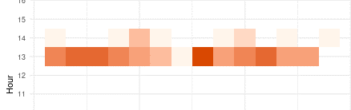{width=60%}   
However, some of them are open late at night. The most suspicious is the Kronos Mart.  
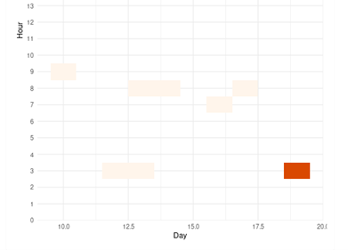{width=60%}   
Most of the business hours shown in the figure are concentrated in the early morning and morning. Although the possibility that the store will be open 24 hours a day is not ruled out, there are no orders in the afternoon and evening, which are the peak hours of other stores. Overall, Kronos Mart is one of the suspected locations.  

5.3.2 Analyze suspicious place based on activities

After observing the staff's daily action route, we found that most of the staff's whereabouts are very regular during workdays, such as leaving home every morning and going for a walk in the park at night. Since most employees go to work in the morning, they usually do not go out at midnight and early morning. We have made statistics on the actions taken during these periods of time.  

{width=70%} 

Based on the strange time of activities and the location where these activities happen, we found two suspicious locations with fixed locations and three locations with only latitude and longitude. We consider these five locations to be suspicious. At the same time, these employees are also somewhat suspicious.  
The suspicious employees are as follow.  

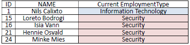{width=60%} 

We could see there are totally two employment type and 4 of suspicious employees are the same type.  

5.3.3 Analyze suspicious relationship 

As we analyze where people live, we  found some of them live together or in the same building. This is a base of further analyze. It is not strange if they usually meet.  

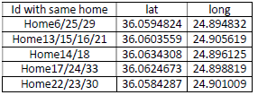{width=60%} 

According to the character relationship network diagram we have made, it is generally believed that if the character relationship is too complicated or there are too many contacts with people from other departments, then the character relationship can be considered as possible. Below is the character relationship diagram of five suspicious characters. We can see that their character relationships are usually very complicated. If we need to study suspicious relationships, we can first look for clues from their network of relationships.  

{width=60%}   

## 6.	FUTURE WORK  
We hope that in the future, we can add the specific business hours data of each store or the guess about the business hours of the stores obtained from session one into the session two, and combine it with the original gps data, so that mark the suspect's patronage during business hours as black on the map, and the patronage during non-business hours as red.  
Also, we did not find the exact standard for suspicious characters. First of all, the standard for judging is single, and we cannot directly infer that the relationship is suspicious. Secondly, if people take improper actions, they may try to avoid meeting in daily life, which makes judgments more difficult. We hope to find better ways to infer suspicious relationships between characters in the future.  
In addition, we also hope that in the future we will be able to make the suspect’s driving path diagram dynamic, so that when we select several target suspects, we can simulate their action trajectory through dynamic points that represent their real-time positions, and see their intersection more intuitively.


