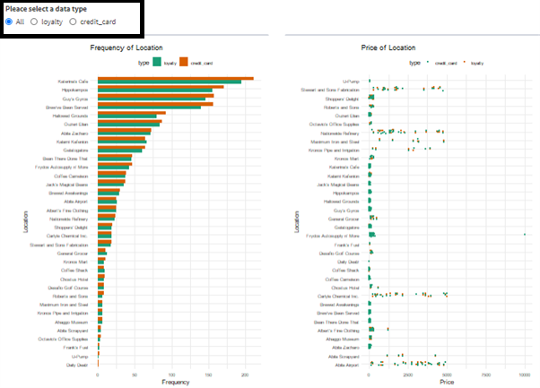
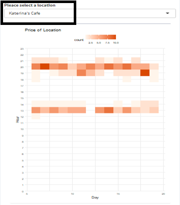
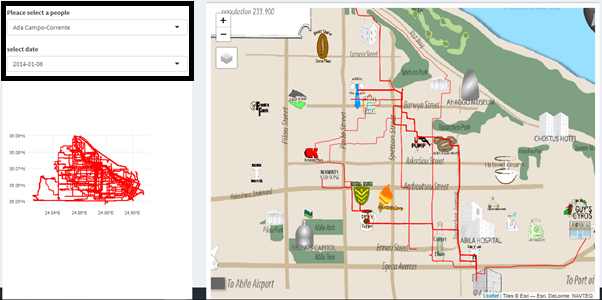
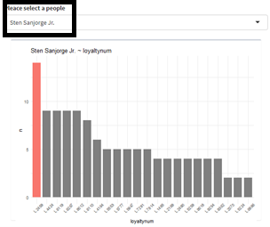
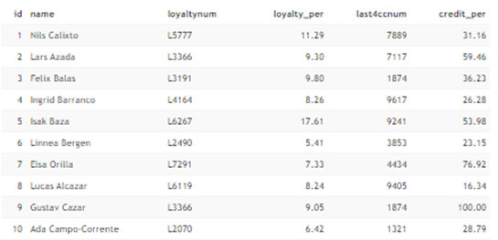
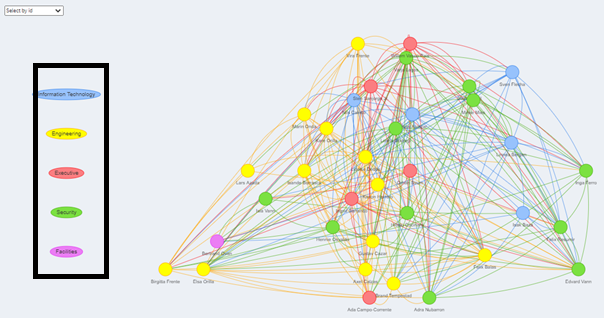
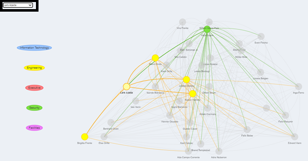

```{r setup, include=FALSE}
knitr::opts_chunk$set(echo = FALSE)
```

# User Guide

This document gives a short description of our R Shiny Application and an overview of the application layout.

## 1. Location & Consumption

The interface of the first session is divided into two parts. The two graphs on the left-hand side are a bar graph showing the frequency of purchases in each store and a scatter plot showing every single transaction amount in each store. At the upper left corner of the panel, user can select credit card, loyalty card, or both showing at the same time.

{width=90%}

As for the mosaic chart on the right-hand side, users can select the store name in the drop-down list at the top of the panel, or select ‘all’, so that to show the patronized situation all shops as a whole.

{width=90%}

## 2. GPS Tracking

The graph in the lower left corner shows all the driving path records in the two weeks before the incident, in which the thickness of the red line greatly reflects the popularity of the places. After selecting the suspect's name and his/her travel date in the upper left corner of the interface, user can see that the map on the right will change accordingly.

{width=90%}

## 3. Credit & Loyalty Card Ownership

Utilizing the time variables of transaction data and gps data to identify which vehicles stayed at a specific merchant at a specific time, we can generate a list including all associations of card numbers and consumers. The combinations that appear frequently in multiple lists, that is, the association with the highest frequency, can be preliminarily determined as the ownership between the card and the consumer. 

At the top of the panel on the right, users can select the name of the suspect, and the bar chart below can correspondingly display the cards that may be identified as the suspect’s and their corresponding frequency.

{width=50%}

{width=50%}

The left side of the interface displays the complete list of employees, the end numbers of membership cards and credit cards that most likely to be determined as their cards, and the frequency of the association appearing.

## 4. Relationship

Each node in the relationship graph represents an employee, and nodes are given diverse colors to help users distinguish their job category.
{width=90%}

The dropdown list in the upper left corner enables the users to select the name of the suspect to be investigated. After selecting the target task, you can see that the personnel nodes and connections in the relationship network diagram that have nothing to do with the personnel will be grayed out, and only those with potential relationships will be remained.

{width=90%}

